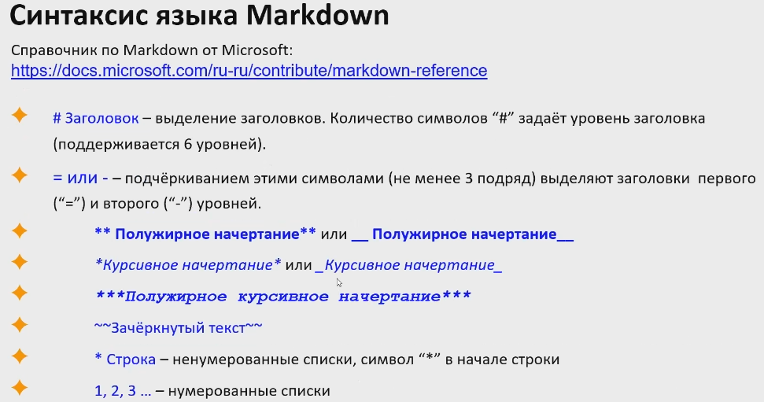

Разметка Markdown

Заголовки H1–H6 выделяются в Markdown с помощью знаков решетки (диез/шарп). Можно просто поставить нужное количество решеток в начале строки, чтобы указать уровень

## Выделение жирным ## перед текстом

Другой вариант: написать текст первого заголовка, затем нажать Enter и на следующей строке указать любое количество знаков «равно». Аналогичным образом можно выделить H2, только использовать уже нужно дефисы. Заголовки других уровней таким методом оформить нельзя.

Это H1 или Заголовок I
===
*===*

Это H2 или Заголовок II
---
*---*

**Полужирный ** в начале и в конце**

*курсив по одной * в начале и в конце* , альтернативный способ: нижнее подчеркивание

## Списки

* ненумерованный список
1. нумерованный список

Если пункт списка включает несколько строк или абзацев, нужно соблюдать всё те же отступы, чтобы было красиво оформлено. Ключевые мысли в списках также можно выделять другой разметкой, например, жирным. Примеры:

* __Тезис №1__

    Раскрываем тезис.

* __Тезис №2__

    Раскрываем тезис.

---

* __Тезис №1__ Раскрываем тезис.

* __Тезис №2__ Раскрываем тезис.

Для любителей чек-листов есть такая возможность. Чек-бокс получится, если в начале строки вставить пробел, заключенный с двух сторон в квадратные скобки. Можно сразу задать выполненную задачу с помощью [X]. С оформлением ссылок по-другому – в квадратных скобках или текст, или ничего.

## Работа с изображениями

Чтобы добавить изображение необходимо написать следующее:

## Ссылки

Чтобы поставить гиперссылку без анкора, нужно взять URL в угловые скобки. С e-mail – аналогично.

Если вставлять с анкором, то тогда текст ссылки заключается в квадратные скобки, а адрес страницы – в круглые. Рядом с URL можно прописать тайтл, его объявляют в кавычках (он тоже остается внутри круглых скобок).

Это [ссылка]( "Агентство TexTerra") с тайтлом.

[Эта ссылка](http://example.net/) без заголовка.

<https://texterra.ru/&gt; – а это безанкорная ссылка.
## Работа с таблицами
Если поддерживается расширенная версия Markdown, можно вставлять таблицы. Для этого используются всего два символа: вертикальная черта и дефис. Дефисы работают примерно так же, как в случае с горизонтальной линией: отделяют заголовки от других строк, при этом количество символов значения не имеет. Вертикальная черта служит границей между столбцами.

Пример – таблица меток для блоков кода, об этом было в предыдущем разделе:

| Язык | Метка |
| -----|------|
| Java Script | javascript |
| C++ |cpp|
| HTML|html|
|Markdown|md|
|JSON|json|
|Python|python|
|SQL|sql|

## Цитаты
> цитата
>> вложенная цитата
>>>третий уровень 
## Заключения

Мы разобрали с десяток различных символов, которые используются в разметке Markdown. Но что если эти символы нужны нам в самом тексте? Чтобы спецсимволы не исчезали и не влияли на оформление, нужно использовать экранирование. Как и во многих других языках программирования, этим целям служит обратная косая черта (бэкслеш).