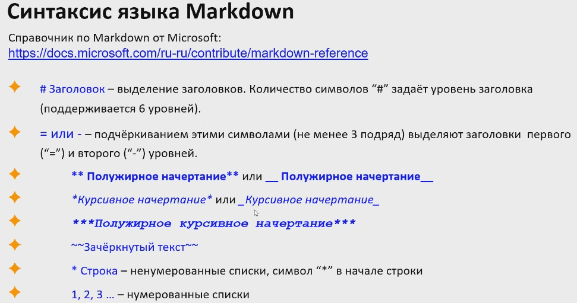

# Инструкция по работе с Git

Начальная работа с системой версии

git --version - проверка версии гит

git init - инициализация локального репозитория

git status - проверка текущего состояния файлов

git add - добавление версионности файлу

git  commit -am "" - (-am - заменяет git add + message)

git log* - вывод истории комитов в хронологическом порядке

git diff* - вывод изменений на текущий момент по отношению к последнему комиту

git checkout master* или *git checkout хеш-номер_комита* - переход между изменениями либо возврат к текущему состоянию

git branch - отображение ветки

clear - очиститьтекущий лог

git merge - слияние  веток

git log --graph -  отображение всех веток

git clone http://... - клонировать удаленный репозиторий

git push http://... - записатьизменения в удаленный репозиторий

git pull http://... - взять изменения с удаленного репозитория (может без http)

## Выделение жирным ## перед текстом

**Полужирный ** в начале и в конце**

*курсив по одной * в начале и в конце* , альтернативный способ: нижнее подчеркивание

## Списки

* ненумерованный список
1. нумерованный список

## Работа с изображениями

Чтобы добавить изображение необходимо написать следующее:

## Ссылки

## Работа с таблицами

## Цитаты

## Заключения